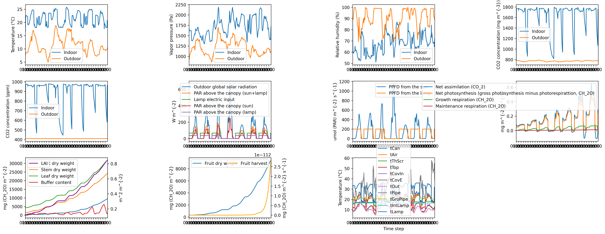

## Languages
- [English](README.md)
- [中文](README_zh.md)

# GreenLightPlus

> **Disclaimer:**
> GreenLightPlus project is developed independently by Daidai Qiu, drawing inspiration and methodological foundations from Dr. David Katzin’s MATLAB-based [GreenLight ](https://github.com/davkat1/GreenLight). Dr.David Katzin did not participate in the development of GreenLightPlus, and his original work is separate and unrelated to the GreenLightPlus project.
> 
> If you have any questions regarding GreenLightPlus, please contact Daidai Qiu at [qiu.daidai@outlook.com](mailto:qiu.daidai@outlook.com).
> If you have any questions regarding GreenLight, please visit [https://github.com/davkat1/GreenLight](https://github.com/davkat1/GreenLight) to contact Dr. David Katzin.


GreenLightPlus is a Python toolkit for greenhouse environment simulation and energy consumption and yield optimization, which provides the following improvements and extensions:

- Ported the original model from MATLAB to Python, improving accessibility and extensibility.
- Supports the generation of various greenhouse geometric structures for comparative analysis.
- Integrates EnergyPlus simulation functionality for more accurate energy consumption calculations.
- Includes a built-in reinforcement learning environment that can be used with AI algorithms to optimize greenhouse control strategies.

GreenLightPlus aims to help users design and manage greenhouses more efficiently, achieving energy optimization and crop yield enhancement. By using this toolkit, users can explore different greenhouse design options, evaluate their energy performance, and employ advanced optimization algorithms to find the best control strategies, improving the economic and environmental benefits of the greenhouse.

## Documentation

For detailed usage instructions and examples, please visit our documentation website: [Documentation](https://botanicbyte.com/quickstart)


## Key Features

- **Comprehensive Greenhouse Environment Simulation**: GreenLightPlus provides a complete greenhouse environment simulation, including the dynamic changes of key parameters such as temperature, humidity, light, and CO2 concentration, as well as the simulation of crop growth processes.

- **Flexible Greenhouse Geometric Modeling**: The toolkit supports the generation of six common types of greenhouse geometric structures, including triangular, semi-circular, flat arch, Gothic arch, sawtooth, and sawtooth arch. Users can choose the appropriate structure for analysis based on their requirements.

- **Reinforcement Learning Optimization Strategies**: GreenLightPlus includes a built-in reinforcement learning environment specifically designed for greenhouse control tasks. Users can utilize this environment to train AI models that automatically learn optimal greenhouse control strategies, improving energy utilization efficiency and crop yield.

- **Energy Consumption Analysis and Yield Prediction**: Through integration with EnergyPlus, GreenLightPlus can perform detailed energy consumption analyses for different greenhouse configurations and predict crop yields based on environmental conditions and control strategies, providing important information for greenhouse design and operation.

## Core Modules

- `green_light_model.py` - Implements the Python-based GreenLight model for greenhouse environment simulation.
- `greenhouse_env.py` - Defines the greenhouse environment class for reinforcement learning.
- `greenhouse_geometry.py` - Used to generate geometric models for different greenhouse structures.
- `greenlight_energyplus_simulation.py` - Combines the GreenLight model and EnergyPlus for simulation and analysis.

## Auxiliary Modules

- `create_green_light_model/` - Contains core functions for creating and setting up the GreenLight model.
- `result_analysis/` - Provides functions for analyzing simulation results, including energy analysis and result visualization.
- `service_functions/` - Provides a function library for unit conversions and other service functionalities.

To ensure users can smoothly use the GreenLightPlus package in combination with EnergyPlus for simulations, we need to provide detailed guidance on downloading and installing EnergyPlus. Here are the steps for downloading and installing EnergyPlus, as well as obtaining the necessary weather files, which can be included in the README:

---

## Prerequisites: Installing EnergyPlus

To run the EnergyPlus-combined simulations in the GreenLightPlus package, you need to have EnergyPlus installed on your system. 

### Download and Install

1. **Download EnergyPlus**: Use the `wget` command to download the Linux version of EnergyPlus from the official GitHub repository.

   ```bash
   wget https://github.com/NREL/EnergyPlus/releases/download/v23.2.0/EnergyPlus-23.2.0-7636e6b3e9-Linux-Ubuntu22.04-x86_64.tar.gz
   ```
   You can visit the [NREL EnergyPlus GitHub page](https://github.com/NREL/EnergyPlus) to select the latest version suitable for your operating system.

2. **Extract the File**: Use the `tar` command to extract the downloaded file.

   ```bash
   tar -xzvf EnergyPlus-23.2.0-7636e6b3e9-Linux-Ubuntu22.04-x86_64.tar.gz
   ```

3. **Move the Extracted Folder**: Move the extracted folder to a suitable location, e.g., a folder named `EnergyPlus`.

   ```bash
   mv EnergyPlus-23.2.0-7636e6b3e9-Linux-Ubuntu22.04-x86_64 EnergyPlus
   ```

### Get Weather Files

EnergyPlus simulations require weather files for specific locations. Here's how to download the EPW weather file for Amsterdam:

```bash
wget https://energyplus-weather.s3.amazonaws.com/europe_wmo_region_6/NLD/NLD_Amsterdam.062400_IWEC/NLD_Amsterdam.062400_IWEC.epw
```

Move this file to your project directory or a specified folder, ensuring the correct file path when running simulations.

More weather files can be downloaded from the [EnergyPlus Weather Database](https://energyplus.net/weather), where you can select files suitable for your project's location.

## Installation

```bash
pip install GreenLightPlus
```

## Usage Guide

### 1. Using GreenLightPlus to Create Greenhouse Geometry Files

The GreenLightPlus package allows users to create greenhouse geometrical models with different roof types to support environment simulations. Here's how to use the `GreenhouseGeometry` class to generate greenhouses with various roof types.

#### Quick Start

First, you need to import the `GreenhouseGeometry` class from GreenLightPlus. Then, you can specify different roof types and generate a greenhouse model for each type.

```python
from GreenLightPlus import GreenhouseGeometry

if __name__ == "__main__":
    # Define different roof types
    roof_types = [
        "triangle",
        "half_circle",
        "flat_arch",
        "gothic_arch",
        "sawtooth",
        "sawtooth_arch",
    ]

    for roof_type in roof_types:
        print(f"Creating greenhouse with {roof_type} roof")
        # Set basic greenhouse parameters
        wall_height = 6.5  # Ridge height {m}
        wall_width = 4     # Width of each roof segment {m}
        wall_length = 1.67 # Greenhouse length {m}
        num_segments = 6   # Number of roof segments
        slope = 22         # Roof slope angle {°}
        number_length = 10 # Number of greenhouses in length direction
        number_width = 10  # Number of greenhouses in width direction
        time_step = 60     # Time step (minutes)

        # Create a GreenhouseGeometry instance
        greenhouse_model = GreenhouseGeometry(
            roof_type=roof_type,
            slope=slope,
            wall_height=wall_height,
            wall_width=wall_width,
            wall_length=wall_length,
            num_segments=num_segments,
            time_step=time_step,
            number_width=number_width,
            number_length=number_length,
            max_indoor_temp=60,
            min_indoor_temp=0,
            max_outdoor_temp=60,
            min_outdoor_temp=0,
            max_delta_temp=1,
            max_wind_speed=30,
            start_month=4,
            start_day=1,
            end_month=4,
            end_day=7,
        )

        # Generate the greenhouse model
        greenhouse_model.create_houses()
```

#### Functionality Description

With the above code, you can create greenhouse geometrical models with different roof types. These models can be used for further environment simulations and energy consumption analysis. You can adjust the parameters of the `GreenhouseGeometry` class to suit your specific needs, such as modifying the greenhouse dimensions, roof type, or the simulation time range.

This functionality is the foundation for understanding and using the GreenLightPlus package, suitable for users who need to perform preliminary simulations and analyses on different greenhouse designs.

#### Result Display


### 2. Using GreenLightPlus to Run the Original GreenLight Model and Plot Results

The GreenLightPlus package allows users to run greenhouse simulations using the original GreenLight model and analyze and visualize the results. Here are detailed steps on how to set simulation parameters, run the simulation, and use the `plot_green_light` function to display the results.

#### Quick Start

First, import the necessary modules and functions from the GreenLightPlus package.

```python
from GreenLightPlus import (
    GreenLightModel,
    extract_last_value_from_nested_dict,
    calculate_energy_consumption,
    plot_green_light,
)

# Set simulation parameters
season_length = 10  # Length of growth cycle (days), can be set as a fraction
season_interval = 10  # Time interval for each model run (days), can be set as a fraction, e.g., 1/24/4 represents 15 minutes
first_day = 91  # First day of the growth cycle (day of the year)

# Create a GreenLight model instance
# Parameter explanation:
# - first_day: Start date of the simulation (day of the year)
# - isMature: Indicates whether the crop is mature
# - epw_path: Path to the weather data file
model = GreenLightModel(first_day=first_day, isMature=True, epw_path="NLD_Amsterdam.062400_IWEC.epw")

# Initialize cumulative variables
total_yield = 0  # Total yield (kg/m2)
lampIn = 0  # Lighting energy consumption (MJ/m2)
boilIn = 0  # Heating energy consumption (MJ/m2)

# Initialize model state and parameters
init_state = {
    "p": {
        # Greenhouse structure settings
        'psi': 22,  # Average slope of greenhouse cover (degrees)
        'aFlr': 4e4,  # Floor area (m^2)
        'aCov': 4.84e4,  # Cover area, including side walls (m^2)
        'hAir': 6.3,  # Height of main area (m) (ridge height is 6.5m, screen is 20cm below)
        'hGh': 6.905,  # Average greenhouse height (m)
        'aRoof': 0.1169*4e4,  # Maximum roof ventilation area (m^2)
        'hVent': 1.3,  # Vertical dimension of a single ventilation opening (m)
        'cDgh': 0.75,  # Discharge coefficient for ventilation (dimensionless)
        'lPipe': 1.25,  # Length of pipe-rail heating system (m/m^2)
        'phiExtCo2': 7.2e4*4e4/1.4e4,  # CO2 injection capacity for the entire greenhouse (mg/s)
        'pBoil': 300*4e4,  # Boiler capacity for the entire greenhouse (W)

        # Control settings
        'co2SpDay': 1000,  # CO2 setpoint during light period (ppm)
        'tSpNight': 18.5,  # Temperature setpoint during dark period (°C)
        'tSpDay': 19.5,  # Temperature setpoint during light period (°C)
        'rhMax': 87,  # Maximum relative humidity (%)
        'ventHeatPband': 4,  # P-band for ventilation at high temperature (°C)
        'ventRhPband': 50,  # P-band for ventilation at high relative humidity (% humidity)
        'thScrRhPband': 10,  # P-band for screen opening at high relative humidity (% humidity)
        'lampsOn': 0,  # Time to turn on lights (h)
        'lampsOff': 18,  # Time to turn off lights (h)
        'lampsOffSun': 400,  # Global radiation above which lamps are turned off (W/m^2)
        'lampRadSumLimit': 10  # Predicted daily sum of solar radiation below which lamps are used (MJ/m^2/day)
    }
}

# Run the model based on growth cycle and time interval
for current_step in range(int(season_length // season_interval)):
    # Run the model and get results
    gl = model.run_model(gl_params=init_state, season_length=season_length,
                         season_interval=season_interval, step=current_step)
    init_state = gl
    dmc = 0.06  # Dry matter content

    # Calculate and print current yield (kg/m2)
    current_yield = 1e-6 * calculate_energy_consumption(gl, 'mcFruitHar') / dmc
    print(f"Current yield: {current_yield:.2f} kg/m2")

    # Accumulate fruit yield (kg/m2)
    total_yield += current_yield

    # Calculate and accumulate energy consumption from lighting and heating (MJ/m2)
    lampIn += 1e-6 * calculate_energy_consumption(gl, "qLampIn", "qIntLampIn")
    boilIn += 1e-6 * calculate_energy_consumption(gl, "hBoilPipe", "hBoilGroPipe")

# Print final results
print(f"Total yield: {total_yield:.2f} kg/m2")
print(f"Lighting energy consumption: {lampIn:.2f} MJ/m2")
print(f"Heating energy consumption: {boilIn:.2f} MJ/m2")
print(f"Energy consumption per unit: {(lampIn + boilIn)/total_yield:.2f} MJ/kg")

# Plot model results
plot_green_light(gl)
```

#### Functionality Description

This example code demonstrates how to use the GreenLightModel class to run greenhouse environment simulations. By looping through the growing season, the simulation steps through the environmental changes, and the `calculate_energy_consumption` function is used to evaluate energy consumption and yield. Finally, the `plot_green_light` function visualizes the results of the entire simulation process, showing the changes in various environmental parameters inside the greenhouse, such as temperature, humidity, CO2 concentration, and lighting and heating energy consumption over time.

#### Result Display


The `plot_green_light` function generates a comprehensive figure displaying the changes in environmental parameters and crop growth dynamics within the simulated greenhouse. The figure includes the following subplots:

1. Indoor and outdoor temperature in degrees Celsius ($^\circ\mathrm{C}$).
2. Indoor and outdoor vapor pressure in Pascals ($\mathrm{Pa}$).
3. Indoor and outdoor relative humidity as a percentage ($\%$).
4. Indoor and outdoor CO2 concentration in both milligrams per cubic meter ($\mathrm{mg\,m^{-3}}$) and parts per million ($\mathrm{ppm}$).
5. Outdoor global solar radiation, PAR (Photosynthetically Active Radiation) above the canopy from both sun and lamps, lamp electric input, and PAR above the canopy from sun and lamps separately, all in Watts per square meter ($\mathrm{W\,m^{-2}}$).
6. PPFD (Photosynthetic Photon Flux Density) from the sun and lamps in micromoles of PAR per square meter per second ($\mathrm{\mu mol\,(PAR)\,m^{-2}\,s^{-1}}$).
7. Net assimilation of CO2, net photosynthesis, growth respiration, and maintenance respiration in milligrams per square meter per second ($\mathrm{mg\,m^{-2}\,s^{-1}}$).
8. Fruit, stem, and leaf dry weight in milligrams of CH2O per square meter ($\mathrm{mg\,(CH_2O)\,m^{-2}}$), buffer content also in $\mathrm{mg\,(CH_2O)\,m^{-2}}$, and LAI (Leaf Area Index) in square meters per square meter ($\mathrm{m^2\,m^{-2}}$).
9. Fruit dry weight in milligrams of CH2O per square meter ($\mathrm{mg\,(CH_2O)\,m^{-2}}$) and fruit harvest in milligrams of CH2O per square meter per second ($\mathrm{mg\,(CH_2O)\,m^{-2}\,s^{-1}}$).
10. Various temperature states of the greenhouse components in degrees Celsius ($^\circ\mathrm{C}$).




### 3. Using GreenLightPlus to Run Combined GreenLight and EnergyPlus Simulations

GreenLightPlus integrates the GreenLight model and EnergyPlus, providing higher accuracy greenhouse environment simulations and more detailed energy consumption analyses.

#### Quick Start

First, ensure that you have added the EnergyPlus installation directory to the Python module search path. Then, import the required modules and functions from the GreenLightPlus package.

```python
import sys
# Add the EnergyPlus installation directory to the Python module search path
sys.path.insert(0, "./EnergyPlus")

from GreenLightPlus import GreenhouseSimulation, convert_epw2csv
from pyenergyplus.api import EnergyPlusAPI

if __name__ == "__main__":
    # Create an EnergyPlus API object
    api = EnergyPlusAPI()

    # Set the paths for the weather file and model file
    epw_path = "NLD_Amsterdam.062400_IWEC.epw"
    idf_path = "data/model_files/greenhouse_half_circle.idf"

    # Convert the EPW weather file to a CSV file for easier processing
    csv_path = convert_epw2csv(epw_path=epw_path, time_step=1)

    # Set the output directory
    output_directory = "data/energyPlus/outputs"

    # Set the start date and number of days for the simulation
    first_day = 91
    season_length = 7

    # Create an instance of the GreenhouseSimulation class
    simulation = GreenhouseSimulation(api, epw_path, idf_path, csv_path, output_directory, first_day, season_length, isMature=True)

    # Run the simulation
    simulation.run()

    # Get the simulation results
    total_yield, lampIn, boilIn = simulation.get_results()
    print(f"Total yield: {total_yield} kg/m2, Lamp input: {lampIn} MJ/m2, Boiler input: {boilIn} MJ/m2\n")
```

#### Functionality Description

This example code demonstrates how to use the `GreenhouseSimulation` class and the EnergyPlus API to run greenhouse environment simulations that combine the GreenLight model with EnergyPlus. This simulation will use EnergyPlus for detailed energy consumption analysis, while incorporating the crop growth and environmental control models provided by GreenLight.

#### Result Display

After the simulation is completed, statistics on total yield, lighting input, and boiler input will be output. This data helps users evaluate the effectiveness of the greenhouse design and control strategies, as well as their impact on energy consumption and yield.

### 4. Using GreenLightPlus for Reinforcement Learning Optimization of Greenhouse Management

The GreenLightPlus package integrates a reinforcement learning environment, allowing users to utilize reinforcement learning algorithms (such as PPO) to optimize greenhouse management and operation strategies. Here are the steps to configure and run PPO training.

#### Quick Start

First, you need to import the `GreenhouseEnv` environment from GreenLightPlus and configure the PPO algorithm from Ray RLlib.

```python
import sys
from ray.rllib.algorithms.ppo import PPOConfig
from ray.tune.logger import pretty_print
from GreenLightPlus import GreenhouseEnv
from tqdm import tqdm
import os
import random

# Configure the RLlib PPO algorithm
config = PPOConfig()
config.rollouts(num_rollout_workers=1)
config.resources(num_cpus_per_worker=1)
config.environment(
        env=GreenhouseEnv,
        env_config={
            "first_day": 101,  # Start date of the year
            "epw_path": "NLD_Amsterdam.062400_IWEC.epw",  # Path to the weather file
            "isMature": False,  # Whether it's the mature stage
            "season_length": 60,  # Length of the simulated season
            "season_interval": 1/24*4,  # Time interval for the simulation, every 6 hours
            "current_step": 0,  # Current step number
            "target_yield": 8,  # Target yield
            "target_yield_unit_energy_input": 22,  # Target unit energy input yield
            "init_state": {
                "p": {
                    # Greenhouse structure settings
                    'psi': 22,  # Mean greenhouse cover slope [degrees]
                    'aFlr': 4e4,  # Floor area [m^2]
                    # Surface of the cover including side walls [m^2]
                    'aCov': 4.84e4,
                    # Height of the main compartment [m] (the ridge height is 6.3, screen is 20 cm below it)
                    'hAir': 6.3,
                    'hGh': 6.905,  # Mean height of the greenhouse [m]
                    'aRoof': 0.1169*4e4,  # Maximum roof ventilation area
                    # Vertical dimension of single ventilation opening [m]
                    'hVent': 1.3,
                    'cDgh': 0.75,  # Ventilation discharge coefficient [-]
                    'lPipe': 1.25,  # Length of pipe rail system [m m^-2]
                    # Capacity of CO2 injection for the entire greenhouse [mg s^-1]
                    'phiExtCo2': 7.2e4*4e4/1.4e4,
                    # Capacity of boiler for the entire greenhouse [W]
                    'pBoil': 300*4e4,

                    # Control settings
                    # CO2 setpoint during the light period [ppm]
                    'co2SpDay': 1000,
                    # temperature set point dark period [°C]
                    'tSpNight': 18.5,
                    # temperature set point light period [°C]
                    'tSpDay': 19.5,
                    'rhMax': 87,  # maximum relative humidity [%]
                    # P-band for ventilation due to high temperature [°C]
                    'ventHeatPband': 4,
                    # P-band for ventilation due to high relative humidity [% humidity]
                    'ventRhPband': 50,
                    # P-band for screen opening due to high relative humidity [% humidity]
                    'thScrRhPband': 10,
                    # time of day (in morning) to switch on lamps [h]
                    'lampsOn': 0,
                    # time of day (in evening) to switch off lamps [h]
                    'lampsOff': 18,
                    # lamps are switched off if global radiation is above this value [W m^-2]
                    'lampsOffSun': 400,
                    # Predicted daily radiation sum from the sun where lamps are not used that day [MJ m^-2 day^-1]
                    'lampRadSumLimit': 10
                }
            }
        },
        render_env=False  # Whether to render the environment
    )
config.training(
        gamma=0.9,  # Discount factor
        lr=0.0001,  # Learning rate
        kl_coeff=0.3,  # KL divergence coefficient
        model={
            "fcnet_hiddens": [256, 256],  # Hidden layer configuration
            "fcnet_activation": "relu",  # Activation function
            "use_lstm": True,  # Whether to use LSTM
            "max_seq_len": 48,  # Maximum sequence length
        }
    )

# Build the algorithm object
algo = config.build()

# Train the algorithm
for episode in tqdm(range(250)):  # Train for 250 episodes
    result = algo.train()  # Perform training
    if episode % 5 == 0:  # Save a checkpoint every 5 episodes
        checkpoint_dir = algo.save().checkpoint.path
        print(f"Checkpoint saved in directory {checkpoint_dir}")
```

#### Functionality Description

This example code demonstrates how to use Ray RLlib and the PPO algorithm to train a reinforcement learning model for greenhouse environment optimization. By adjusting the environment parameters and training settings, you can explore different strategies to improve the greenhouse's energy efficiency and crop yield.

#### Result Display

Checkpoints will be saved periodically during the training process, and the current training results will be printed. These results help users evaluate the algorithm's performance and iteratively optimize the greenhouse management strategies.


## Contributing

Contributions through Pull Requests or Issues for feature enhancements or bug reports are welcome.

## License

This project is licensed under the GNU GPLv3 License. See the `LICENSE` file for details.

## References
David Katzin, Simon van Mourik, Frank Kempkes, and Eldert J. Van Henten. 2020. "GreenLight - An Open Source Model for Greenhouses with Supplemental Lighting: Evaluation of Heat Requirements under LED and HPS Lamps." Biosystems Engineering 194: 61–81. https://doi.org/10.1016/j.biosystemseng.2020.03.010
