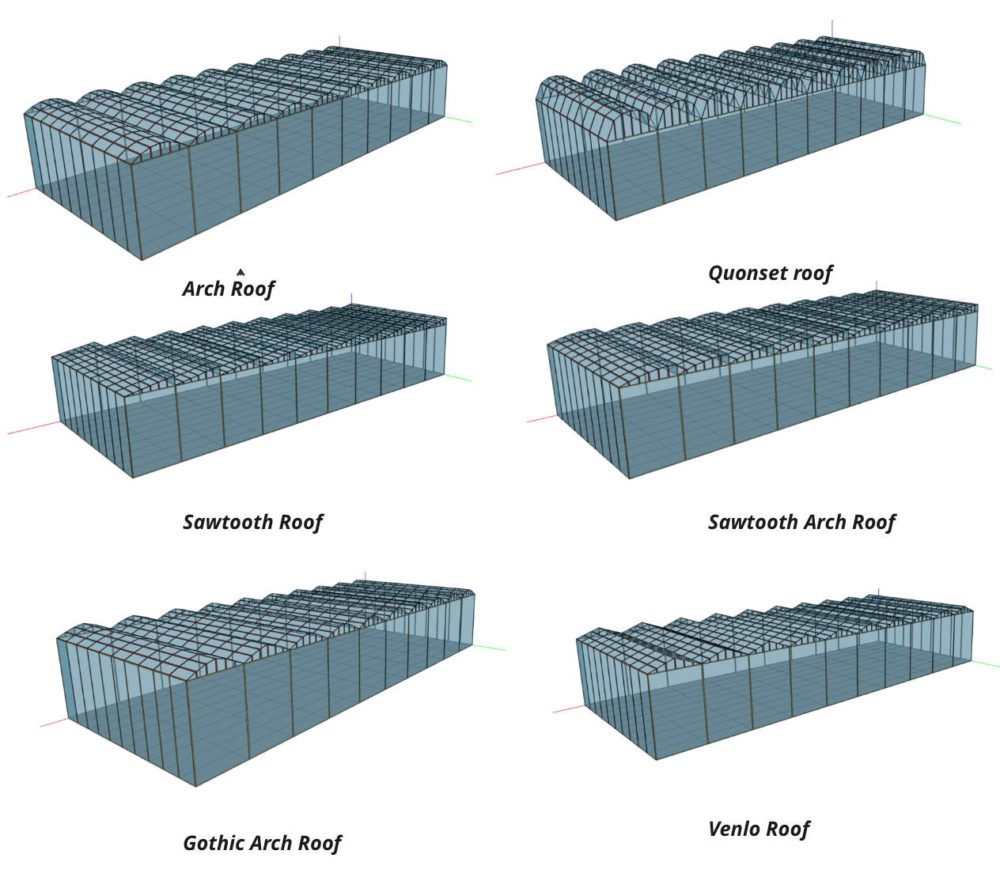

## Languages
- [English](README.md)
- [中文](README_zh.md)

# GreenLightPlus

GreenLightPlus is a ToolKit for greenhouse environment simulation and energy consumption-yield analysis. It combines the original GreenLight model and the EnergyPlus simulation tool to investigate the energy consumption and output of different greenhouse structures.

## Features

- **Simulation and Analysis**: Provides comprehensive greenhouse environment simulation and energy consumption analysis.
- **Diverse Greenhouse Structures**: Supports generating six different greenhouse geometries.
- **Reinforcement Learning Environment**: Includes a customized reinforcement learning environment for greenhouse control tasks.
- **Integrated Simulation**: Combines the GreenLight model with EnergyPlus simulations, offering in-depth energy consumption and yield research for different greenhouse configurations.

## Core Modules

- `green_light_model.py` - Implements the Python-based GreenLight model for greenhouse environment simulation.
- `greenhouse_env.py` - Defines the greenhouse environment class for reinforcement learning.
- `greenhouse_geometry.py` - Used to generate geometric models for different greenhouse structures.
- `greenlight_energyplus_simulation.py` - Combines the GreenLight model and EnergyPlus for simulation and analysis.

## Auxiliary Modules

- `create_green_light_model/` - Contains core functions for creating and setting up the GreenLight model.
- `result_analysis/` - Provides functions for analyzing simulation results, including energy analysis and result visualization.
- `service_functions/` - Provides a function library for unit conversions and other service functionalities.

To ensure users can smoothly use the GreenLightPlus package in combination with EnergyPlus for simulations, we need to provide detailed guidance on downloading and installing EnergyPlus. Here are the steps for downloading and installing EnergyPlus, as well as obtaining the necessary weather files, which can be included in the README:

---

## Prerequisites: Installing EnergyPlus

To run the EnergyPlus-combined simulations in the GreenLightPlus package, you need to have EnergyPlus installed on your system. The following steps will guide you through downloading and installing EnergyPlus on a Linux system.

### Download and Install

1. **Download EnergyPlus**: Use the `wget` command to download the Linux version of EnergyPlus from the official GitHub repository.

   ```bash
   wget https://github.com/NREL/EnergyPlus/releases/download/v23.2.0/EnergyPlus-23.2.0-7636e6b3e9-Linux-Ubuntu22.04-x86_64.tar.gz
   ```
   You can visit the [NREL EnergyPlus GitHub page](https://github.com/NREL/EnergyPlus) to select the latest version suitable for your operating system.

2. **Extract the File**: Use the `tar` command to extract the downloaded file.

   ```bash
   tar -xzvf EnergyPlus-23.2.0-7636e6b3e9-Linux-Ubuntu22.04-x86_64.tar.gz
   ```

3. **Move the Extracted Folder**: Move the extracted folder to a suitable location, e.g., a folder named `EnergyPlus`.

   ```bash
   mv EnergyPlus-23.2.0-7636e6b3e9-Linux-Ubuntu22.04-x86_64 EnergyPlus
   ```

### Get Weather Files

EnergyPlus simulations require weather files for specific locations. Here's how to download the EPW weather file for Amsterdam:

```bash
wget https://energyplus-weather.s3.amazonaws.com/europe_wmo_region_6/NLD/NLD_Amsterdam.062400_IWEC/NLD_Amsterdam.062400_IWEC.epw
```

Move this file to your project directory or a specified folder, ensuring the correct file path when running simulations.

More weather files can be downloaded from the [EnergyPlus Weather Database](https://energyplus.net/weather), where you can select files suitable for your project's location.

## Installation

```bash
pip install GreenLightPlus
```

## Usage Guide

### 1. Using GreenLightPlus to Create Greenhouse Geometry Files

The GreenLightPlus package allows users to create greenhouse geometrical models with different roof types to support environment simulations. Here's how to use the `GreenhouseGeometry` class to generate greenhouses with various roof types.

#### Quick Start

First, you need to import the `GreenhouseGeometry` class from GreenLightPlus. Then, you can specify different roof types and generate a greenhouse model for each type.

```python
from GreenLightPlus import GreenhouseGeometry

if __name__ == "__main__":
    # Define different roof types
    roof_types = [
        "triangle",
        "half_circle",
        "flat_arch",
        "gothic_arch",
        "sawtooth",
        "sawtooth_arch",
    ]

    for roof_type in roof_types:
        print(f"Creating greenhouse with {roof_type} roof")
        # Set basic greenhouse parameters
        wall_height = 6.5  # Ridge height {m}
        wall_width = 4     # Width of each roof segment {m}
        wall_length = 1.67 # Greenhouse length {m}
        num_segments = 6   # Number of roof segments
        slope = 22         # Roof slope angle {°}
        number_length = 10 # Number of greenhouses in length direction
        number_width = 10  # Number of greenhouses in width direction
        time_step = 60     # Time step (minutes)

        # Create a GreenhouseGeometry instance
        greenhouse_model = GreenhouseGeometry(
            roof_type=roof_type,
            slope=slope,
            wall_height=wall_height,
            wall_width=wall_width,
            wall_length=wall_length,
            num_segments=num_segments,
            time_step=time_step,
            number_width=number_width,
            number_length=number_length,
            max_indoor_temp=60,
            min_indoor_temp=0,
            max_outdoor_temp=60,
            min_outdoor_temp=0,
            max_delta_temp=1,
            max_wind_speed=30,
            start_month=4,
            start_day=1,
            end_month=4,
            end_day=7,
        )

        # Generate the greenhouse model
        greenhouse_model.create_houses()
```

#### Functionality Description

With the above code, you can create greenhouse geometrical models with different roof types. These models can be used for further environment simulations and energy consumption analysis. You can adjust the parameters of the `GreenhouseGeometry` class to suit your specific needs, such as modifying the greenhouse dimensions, roof type, or the simulation time range.

This functionality is the foundation for understanding and using the GreenLightPlus package, suitable for users who need to perform preliminary simulations and analyses on different greenhouse designs.

#### Result Display



### 2. Using GreenLightPlus to Run the Original GreenLight Model and Plot Results

The GreenLightPlus package allows users to run greenhouse simulations using the original GreenLight model and analyze and visualize the results. Here are detailed steps on how to set simulation parameters, run the simulation, and use the `plot_green_light` function to display the results.

#### Quick Start

First, import the necessary modules and functions from the GreenLightPlus package.

```python
from GreenLightPlus import (
    GreenLightModel,
    extract_last_value_from_nested_dict,
    calculate_energy_consumption,
    plot_green_light,
)

# Set the growing season length and time interval for the model run
season_length = 7  # Growing season, can be a fraction of days
season_interval = 7  # Time interval for each model run, can be a fraction of days, e.g., 1/24/4 for 15 minutes
first_day = 91  # Date of the first day of the growing season

# Create a GreenLightModel instance
model = GreenLightModel(first_day=first_day, isMature=False, epw_path="NLD_Amsterdam.062400_IWEC.epw")

# Initialize the model state
init_state = {
    "p": {
        # Greenhouse structure settings
        'psi': 22,  # Greenhouse covering slope [degrees]
        'aFlr': 4e4,  # Floor area [m^2]
        # Other parameters omitted...
    }
}

# Run the model based on the set growing season and time interval
for current_step in range(int(season_length // season_interval)):
    gl = model.run_model(gl_params=init_state, season_length=season_length, season_interval=season_interval, step=current_step)
    init_state = gl
    dmc = 0.06  # Dry matter conversion coefficient

    # Calculate and print the current yield
    current_yield = 1e-6 * calculate_energy_consumption(gl, 'mcFruitHar') / dmc
    print(f"current yield is {current_yield} kg/m2")

# Visualize the simulation results
plot_green_light(gl)
```

#### Functionality Description

This example code demonstrates how to use the GreenLightModel class to run greenhouse environment simulations. By looping through the growing season, the simulation steps through the environmental changes, and the `calculate_energy_consumption` function is used to evaluate energy consumption and yield. Finally, the `plot_green_light` function visualizes the results of the entire simulation process, showing the changes in various environmental parameters inside the greenhouse, such as temperature, humidity, CO2 concentration, and lighting and heating energy consumption over time.

#### Result Display

The `plot_green_light` function will generate a chart displaying the changes in environmental parameters inside and outside the greenhouse, such as temperature, humidity, CO2 concentration, as well as lighting and heating energy consumption. This will help users evaluate the effectiveness of the simulation and optimize the greenhouse design.


### 3. Using GreenLightPlus to Run Combined GreenLight and EnergyPlus Simulations

GreenLightPlus integrates the GreenLight model and EnergyPlus, providing higher accuracy greenhouse environment simulations and more detailed energy consumption analyses.

#### Quick Start

First, ensure that you have added the EnergyPlus installation directory to the Python module search path. Then, import the required modules and functions from the GreenLightPlus package.

```python
import sys
# Add the EnergyPlus installation directory to the Python module search path
sys.path.insert(0, "./EnergyPlus")

from GreenLightPlus import GreenhouseSimulation, convert_epw2csv
from pyenergyplus.api import EnergyPlusAPI

if __name__ == "__main__":
    # Create an EnergyPlus API object
    api = EnergyPlusAPI()

    # Set the paths for the weather file and model file
    epw_path = "NLD_Amsterdam.062400_IWEC.epw"
    idf_path = "data/model_files/greenhouse_half_circle.idf"

    # Convert the EPW weather file to a CSV file for easier processing
    csv_path = convert_epw2csv(epw_path=epw_path, time_step=1)

    # Set the output directory
    output_directory = "data/energyPlus/outputs"

    # Set the start date and number of days for the simulation
    first_day = 91
    season_length = 7

    # Create an instance of the GreenhouseSimulation class
    simulation = GreenhouseSimulation(api, epw_path, idf_path, csv_path, output_directory, first_day, season_length, isMature=True)

    # Run the simulation
    simulation.run()

    # Get the simulation results
    total_yield, lampIn, boilIn = simulation.get_results()
    print(f"Total yield: {total_yield} kg/m2, Lamp input: {lampIn} MJ/m2, Boiler input: {boilIn} MJ/m2\n")
```

#### Functionality Description

This example code demonstrates how to use the `GreenhouseSimulation` class and the EnergyPlus API to run greenhouse environment simulations that combine the GreenLight model with EnergyPlus. This simulation will use EnergyPlus for detailed energy consumption analysis, while incorporating the crop growth and environmental control models provided by GreenLight.

#### Result Display

After the simulation is completed, statistics on total yield, lighting input, and boiler input will be output. This data helps users evaluate the effectiveness of the greenhouse design and control strategies, as well as their impact on energy consumption and yield.

### 4. Using GreenLightPlus for Reinforcement Learning Optimization of Greenhouse Management

The GreenLightPlus package integrates a reinforcement learning environment, allowing users to utilize reinforcement learning algorithms (such as PPO) to optimize greenhouse management and operation strategies. Here are the steps to configure and run PPO training.

#### Quick Start

First, you need to import the `GreenhouseEnv` environment from GreenLightPlus and configure the PPO algorithm from Ray RLlib.

```python
import sys
from ray.rllib.algorithms.ppo import PPOConfig
from ray.tune.logger import pretty_print
from GreenLightPlus import GreenhouseEnv
from tqdm import tqdm
import os
import random

# Configure the RLlib PPO algorithm
config = PPOConfig()
config.rollouts(num_rollout_workers=1)
config.resources(num_cpus_per_worker=1)
config.environment(
        env=GreenhouseEnv,
        env_config={
            "first_day": 101,  # Start date of the year
            "epw_path": "NLD_Amsterdam.062400_IWEC.epw",  # Path to the weather file
            "isMature": False,  # Whether it's the mature stage
            "season_length": 60,  # Length of the simulated season
            "season_interval": 1/24*4,  # Time interval for the simulation, every 6 hours
            "current_step": 0,  # Current step number
            "target_yield": 8,  # Target yield
            "target_yield_unit_energy_input": 22,  # Target unit energy input yield
            "init_state": {...}  # Initial state configuration, refer to the detailed parameters provided above
        },
        render_env=False  # Whether to render the environment
    )
config.training(
        gamma=0.9,  # Discount factor
        lr=0.0001,  # Learning rate
        kl_coeff=0.3,  # KL divergence coefficient
        model={
            "fcnet_hiddens": [256, 256],  # Hidden layer configuration
            "fcnet_activation": "relu",  # Activation function
            "use_lstm": True,  # Whether to use LSTM
            "max_seq_len": 48,  # Maximum sequence length
        }
    )

# Build the algorithm object
algo = config.build()

# Train the algorithm
for episode in tqdm(range(250)):  # Train for 250 episodes
    result = algo.train()  # Perform training
    if episode % 5 == 0:  # Save a checkpoint every 5 episodes
        checkpoint_dir = algo.save().checkpoint.path
        print(f"Checkpoint saved in directory {checkpoint_dir}")
```

#### Functionality Description

This example code demonstrates how to use Ray RLlib and the PPO algorithm to train a reinforcement learning model for greenhouse environment optimization. By adjusting the environment parameters and training settings, you can explore different strategies to improve the greenhouse's energy efficiency and crop yield.

#### Result Display

Checkpoints will be saved periodically during the training process, and the current training results will be printed. These results help users evaluate the algorithm's performance and iteratively optimize the greenhouse management strategies.

## Contributing

Contributions through Pull Requests or Issues for feature enhancements or bug reports are welcome.

## License

This project is licensed under the GNU GPLv3 License. See the `LICENSE` file for details.