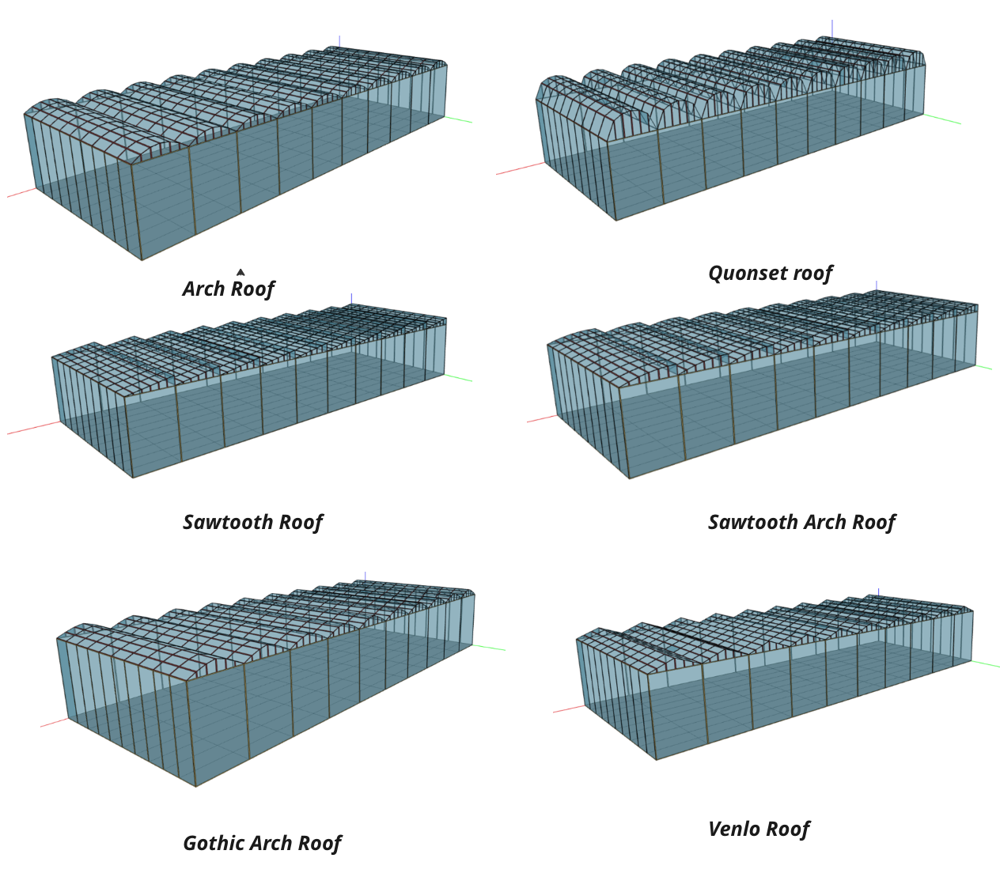
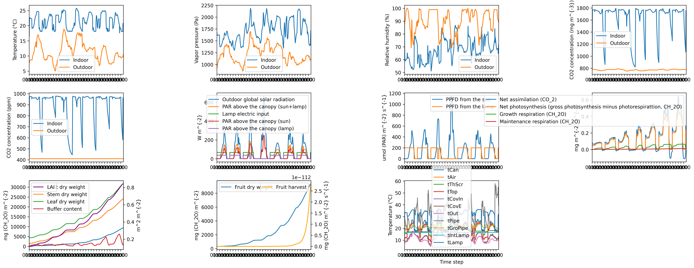

## Languages
- [English](README.md)
- [中文](README_zh.md)

# GreenLightPlus


GreenLightPlus 是一个用于温室环境模拟和能耗产量优化的 Python 工具包，基于 David Katzin 的 MATLAB 版 [GreenLight](https://github.com/davkat1/GreenLight) 模型开发。与原始模型相比，GreenLightPlus 提供了以下改进和扩展：

- 将原始模型从 MATLAB 移植到 Python，提高了可访问性和可扩展性。
- 支持生成多种不同类型的温室几何结构，便于对比分析。
- 集成 EnergyPlus 模拟功能，实现更精确的能耗计算。
- 内置强化学习环境，可使用 AI 算法优化温室控制策略。

GreenLightPlus 旨在帮助用户更高效地设计和管理温室，实现能源优化和作物产量提升。通过使用该工具包，用户可以探索不同的温室设计方案，评估其能耗表现，并使用先进的优化算法找到最佳的控制策略，提高温室的经济和环境效益。


## 主要功能

- **全面的温室环境模拟**：GreenLightPlus 提供了完整的温室环境模拟功能，包括温度、湿度、光照、CO2 浓度等关键参数的动态变化，以及作物生长过程的模拟。

- **灵活的温室几何建模**：该工具包支持生成六种常见的不同类型的温室几何结构，包括三角形、半圆形、平拱形、哥特式拱形、锯齿形和锯齿拱形，用户可以根据需求选择合适的结构进行分析。

- **强化学习优化策略**：GreenLightPlus 内置了一个专门为温室控制任务定制的强化学习环境，用户可以利用该环境训练 AI 模型，自动学习最优的温室控制策略，提高能源利用效率和作物产量。

- **能耗分析与产量预测**：通过与 EnergyPlus 的集成，GreenLightPlus 可以对不同温室配置进行详细的能耗分析，并基于环境条件和控制策略预测作物产量，为温室设计和运营提供重要依据。
  


## 核心模块

- `green_light_model.py` - 实现基于 Python 的 GreenLight 模型，用于温室环境模拟。
- `greenhouse_env.py` - 定义了用于强化学习的温室环境类。
- `greenhouse_geometry.py` - 用于生成不同温室结构的几何模型。
- `greenlight_energyplus_simulation.py` - 结合 GreenLight 模型和 EnergyPlus 进行模拟分析。

## 辅助模块

- `create_green_light_model/` - 包含创建和设置 GreenLight 模型的核心函数。
- `result_analysis/` - 提供模拟结果分析的函数，包括能源分析和结果展示。
- `service_functions/` - 提供单位转换和其他服务功能的函数库。


为确保用户可以顺利使用 GreenLightPlus 包结合 EnergyPlus 进行模拟，我们需要提供详尽的指南来指导他们下载和安装 EnergyPlus。以下是如何下载和安装 EnergyPlus 的步骤，以及如何获取必要的天气文件，这可以被包含在 README 文件中：

---

## 前提条件：安装 EnergyPlus

为了运行 GreenLightPlus 包中的 EnergyPlus 结合模拟，您需要在您的系统中安装 EnergyPlus。以下步骤将指导您如何在 Linux 系统上下载和安装 EnergyPlus。

### 下载和安装

1. **下载 EnergyPlus**: 使用 `wget` 命令从官方 GitHub 存储库下载 EnergyPlus 的 Linux 版本。

   ```bash
   wget https://github.com/NREL/EnergyPlus/releases/download/v23.2.0/EnergyPlus-23.2.0-7636e6b3e9-Linux-Ubuntu22.04-x86_64.tar.gz
   ```
    您可以访问 [NREL EnergyPlus GitHub 页面](https://github.com/NREL/EnergyPlus) 选择适合您操作系统的最新版本。
    

2. **解压缩文件**: 使用 `tar` 命令解压下载的文件。

   ```bash
   tar -xzvf EnergyPlus-23.2.0-7636e6b3e9-Linux-Ubuntu22.04-x86_64.tar.gz
   ```

3. **移动解压缩的文件夹**: 将解压缩后的文件夹移动到合适的位置，例如名为 `EnergyPlus` 的文件夹。

   ```bash
   mv EnergyPlus-23.2.0-7636e6b3e9-Linux-Ubuntu22.04-x86_64 EnergyPlus
   ```

### 获取天气文件

EnergyPlus 模拟需要特定地点的天气文件。以下是如何下载 Amsterdam 的 EPW 天气文件：

```bash
wget https://energyplus-weather.s3.amazonaws.com/europe_wmo_region_6/NLD/NLD_Amsterdam.062400_IWEC/NLD_Amsterdam.062400_IWEC.epw
```

将此文件移动到您的项目目录或指定的文件夹中，确保在运行模拟时正确指定文件路径。

更多天气文件可以从 [EnergyPlus Weather Database](https://energyplus.net/weather) 下载，您可以根据需要选择适合您项目地点的文件。


##  安装

```bash
pip install GreenLightPlus
```

## 使用教程

### 1.使用 GreenLightPlus 创建温室几何文件

GreenLightPlus 包允许用户创建不同类型屋顶的温室几何模型，以支持环境模拟。以下是如何使用 `GreenhouseGeometry` 类来生成不同屋顶类型的温室。

#### 快速开始

首先，您需要从 GreenLightPlus 导入 `GreenhouseGeometry` 类。然后，您可以指定多种屋顶类型，并为每种类型生成一个温室模型。


```python
from GreenLightPlus import GreenhouseGeometry

if __name__ == "__main__":
    # 定义不同的屋顶类型
    roof_types = [
        "triangle",
        "half_circle",
        "flat_arch",
        "gothic_arch",
        "sawtooth",
        "sawtooth_arch",
    ]

    for roof_type in roof_types:
        print(f"Creating greenhouse with {roof_type} roof")
        # 设置温室的基本参数
        wall_height = 6.5  # 脊高 {m}
        wall_width = 4     # 每段屋顶的宽度 {m}
        wall_length = 1.67 # 温室长度 {m}
        num_segments = 6   # 屋顶的段数
        slope = 22         # 屋顶倾斜角度 {°}
        number_length = 10 # 长度方向的温室数量
        number_width = 10  # 宽度方向的温室数量
        time_step = 60     # 时间步长（分钟）

        # 创建 GreenhouseGeometry 实例
        greenhouse_model = GreenhouseGeometry(
            roof_type=roof_type,
            slope=slope,
            wall_height=wall_height,
            wall_width=wall_width,
            wall_length=wall_length,
            num_segments=num_segments,
            time_step=time_step,
            number_width=number_width,
            number_length=number_length,
            max_indoor_temp=60,
            min_indoor_temp=0,
            max_outdoor_temp=60,
            min_outdoor_temp=0,
            max_delta_temp=1,
            max_wind_speed=30,
            start_month=4,
            start_day=1,
            end_month=4,
            end_day=7,
        )

        # 生成温室模型
        greenhouse_model.create_houses()
```

#### 功能描述

通过上述代码，您可以创建不同类型屋顶的温室几何模型。这些模型可以用于进一步的环境模拟和能耗分析。您可以调整 `GreenhouseGeometry` 类的参数来适配您的特定需求，例如修改温室的尺寸、屋顶类型、或者模拟的时间范围。

此功能是理解和使用 GreenLightPlus 包的基础，适用于需要对不同温室设计进行预先模拟和分析的用户。

#### 结果展示




### 2.使用 GreenLightPlus 运行原始 GreenLight 模型并绘制结果

GreenLightPlus 包允许用户使用原始 GreenLight 模型进行温室模拟，并分析及可视化结果。以下是如何设置模拟参数，运行模拟，并使用 `plot_green_light` 函数显示结果的详细步骤。

#### 快速开始

首先，从 GreenLightPlus 包中导入必要的模块和函数。


```python
from GreenLightPlus import (
    GreenLightModel,
    extract_last_value_from_nested_dict,
    calculate_energy_consumption,
    plot_green_light,
)

# 设置生长周期和模型运行的时间间隔
season_length = 7  # 生长周期, 可以是天数的分数
season_interval = 7  # 每次模型运行的时间间隔，可以是天数的分数，例如 1/24/4 表示15分钟
first_day = 91  # 生长周期的第一天的日期

# 创建 GreenLightModel 实例
model = GreenLightModel(first_day=first_day, isMature=False, epw_path="NLD_Amsterdam.062400_IWEC.epw")

# 初始化模型状态
init_state = {
    "p": {
        # 温室结构设置
        'psi': 22,  # 温室覆盖物平均倾斜角度 [度]
        'aFlr': 4e4,  # 地面面积 [平方米]
        'aCov': 4.84e4,  # 包括侧墙在内的覆盖面积 [平方米]
        # 主舱高度 [米]（屋脊高度为6.3米）
        'hAir': 6.3,
        'hGh': 6.905,  # 温室的平均高度 [米]
        'aRoof': 0.1169*4e4,  # 最大屋顶通风面积
        'hVent': 1.3,  # 单个通风口的垂直尺寸 [米]
        'cDgh': 0.75,  # 通风排气系数 [-]
        'lPipe': 1.25,  # 管道轨道系统的长度 [米每平方米]
        # 整个温室的CO2供应速度 [毫克每秒]
        'phiExtCo2': 7.2e4*4e4/1.4e4,
        'pBoil': 300*4e4,  # 整个温室的锅炉容量 [瓦特]

        # 控制设置
        'co2SpDay': 1000,  # 光照期间的CO2设定点 [ppm]
        'tSpNight': 18.5,  # 暗期温度设定点 [摄氏度]
        'tSpDay': 19.5,  # 光照期温度设定点 [摄氏度]
        'rhMax': 87,  # 最大相对湿度 [%]
        # 因高温进行通风的P带宽 [摄氏度]
        'ventHeatPband': 4,
        # 因高相对湿度进行通风的P带宽 [% 湿度]
        'ventRhPband': 50,
        # 因高相对湿度开启遮阳网的P带宽 [% 湿度]
        'thScrRhPband': 10,
        'lampsOn': 0,  # 开灯的时间（早上）[小时]
        'lampsOff': 18,  # 关灯的时间（晚上）[小时]
        # 如果全球辐射超过此值则关灯 [瓦特每平方米]
        'lampsOffSun': 400,
        # 预测的日辐射总量，若达到则当天不使用灯光 [兆焦每平方米每天]
        'lampRadSumLimit': 10
    }
}


# 根据设置的生长周期和时间间隔运行模型
for current_step in range(int(season_length // season_interval)):
    gl = model.run_model(gl_params=init_state, season_length=season_length, season_interval=season_interval, step=current_step)
    init_state = gl
    dmc = 0.06  # 干物质转换系数

    # 计算并打印当前产量
    current_yield = 1e-6 * calculate_energy_consumption(gl, 'mcFruitHar') / dmc
    print(f"current yield is {current_yield} kg/m2")

# 可视化模拟结果
plot_green_light(gl)
```

#### 功能描述

此示例代码展示了如何使用 GreenLightModel 类来运行温室环境模拟。通过循环遍历生长周期，模拟每一步的环境变化，并使用 `calculate_energy_consumption` 函数来评估能耗和产量。最终，使用 `plot_green_light` 函数可视化整个模拟过程的结果，展示温室内的多种环境参数随时间的变化。

#### 结果展示

`plot_green_light` 函数将生成一个图表，展示温室内部和外部的温度、湿度、CO2 浓度等环境参数的变化，以及照明和加热的能耗。这将帮助用户评估模拟的有效性和温室设计的优化。




### 3.使用 GreenLightPlus 结合 GreenLight 和 EnergyPlus 进行模拟

GreenLightPlus 整合了 GreenLight 模型和 EnergyPlus，提供温室环境模拟的更高精度和更细致的能耗分析。

#### 快速开始

首先，确保您已将 EnergyPlus 安装目录添加到 Python 模块的搜索路径中。然后从 GreenLightPlus 包导入所需的模块和功能。


```python
import sys
# 添加EnergyPlus安装目录到Python模块搜索路径
sys.path.insert(0, "./EnergyPlus")

from GreenLightPlus import GreenhouseSimulation, convert_epw2csv
from pyenergyplus.api import EnergyPlusAPI

if __name__ == "__main__":
    # 创建EnergyPlus API对象
    api = EnergyPlusAPI()

    # 设置天气文件和模型文件的路径
    epw_path = "NLD_Amsterdam.062400_IWEC.epw"
    idf_path = "data/model_files/greenhouse_half_circle.idf"

    # 将EPW天气文件转换为CSV文件，便于处理
    csv_path = convert_epw2csv(epw_path=epw_path, time_step=1)

    # 设置输出目录
    output_directory = "data/energyPlus/outputs"

    # 设置模拟的起始日期和天数
    first_day = 91
    season_length = 7

    # 创建GreenhouseSimulation类的实例
    simulation = GreenhouseSimulation(api, epw_path, idf_path, csv_path, output_directory, first_day, season_length, isMature=True)

    # 运行模拟
    simulation.run()

    # 获取模拟结果
    total_yield, lampIn, boilIn = simulation.get_results()
    print(f"Total yield: {total_yield} kg/m2, Lamp input: {lampIn} MJ/m2, Boiler input: {boilIn} MJ/m2\n")
```

#### 功能描述

此示例代码展示了如何使用 `GreenhouseSimulation` 类和 EnergyPlus API 运行结合了 GreenLight 模型与 EnergyPlus 的温室环境模拟。此模拟将使用 EnergyPlus 进行详细的能耗分析，同时结合 GreenLight 提供的作物生长和环境控制模型。

#### 结果展示

模拟完成后，将输出总产量、照明输入和锅炉输入的统计信息。这些数据帮助用户评估温室设计和控制策略的效果，以及其对能耗和产量的影响。


### 4.使用 GreenLightPlus 进行强化学习优化温室管理

GreenLightPlus 包集成了强化学习环境，使用户能够使用强化学习算法（如PPO）来优化温室的管理和操作策略。以下是如何配置和运行 PPO 训练的步骤。

#### 快速开始

首先，您需要从 GreenLightPlus 导入 `GreenhouseEnv` 环境，并配置 Ray RLlib 的 PPO 算法。


```python
import sys
from ray.rllib.algorithms.ppo import PPOConfig
from ray.tune.logger import pretty_print
from GreenLightPlus import GreenhouseEnv
from tqdm import tqdm
import os
import random

# 配置 RLlib PPO 算法
config = PPOConfig()
config.rollouts(num_rollout_workers=1)
config.resources(num_cpus_per_worker=1)
config.environment(
        env=GreenhouseEnv,
        env_config={
            "first_day": 101,  # 一年中的开始日期
            "epw_path": "NLD_Amsterdam.062400_IWEC.epw",  # 天气文件路径
            "isMature": False,  # 是否为成熟阶段
            "season_length": 60,  # 模拟的季节长度
            "season_interval": 1/24*4,  # 模拟的时间间隔，每6小时
            "current_step": 0,  # 当前步骤编号
            "target_yield": 8,  # 目标产量
            "target_yield_unit_energy_input": 22,  # 目标单位能源投入产量
            "init_state" : {
                "p": {
                    # 温室结构设置
                    'psi': 22,  # 温室覆盖物平均倾斜角度 [度]
                    'aFlr': 4e4,  # 地面面积 [平方米]
                    'aCov': 4.84e4,  # 包括侧墙在内的覆盖面积 [平方米]
                    # 主舱高度 [米]（屋脊高度为6.5米）
                    'hAir': 6.3,
                    'hGh': 6.905,  # 温室的平均高度 [米]
                    'aRoof': 0.1169*4e4,  # 最大屋顶通风面积
                    'hVent': 1.3,  # 单个通风口的垂直尺寸 [米]
                    'cDgh': 0.75,  # 通风排气系数 [-]
                    'lPipe': 1.25,  # 管道轨道系统的长度 [米每平方米]
                    # 整个温室的CO2供应速度 [毫克每秒]
                    'phiExtCo2': 7.2e4*4e4/1.4e4,
                    'pBoil': 300*4e4,  # 整个温室的锅炉容量 [瓦特]

                    # 控制设置
                    'co2SpDay': 1000,  # 光照期间的CO2设定点 [ppm]
                    'tSpNight': 18.5,  # 暗期温度设定点 [摄氏度]
                    'tSpDay': 19.5,  # 光照期温度设定点 [摄氏度]
                    'rhMax': 87,  # 最大相对湿度 [%]
                    # 因高温进行通风的P带宽 [摄氏度]
                    'ventHeatPband': 4,
                    # 因高相对湿度进行通风的P带宽 [% 湿度]
                    'ventRhPband': 50,
                    # 因高相对湿度开启遮阳网的P带宽 [% 湿度]
                    'thScrRhPband': 10,
                    'lampsOn': 0,  # 开灯的时间（早上）[小时]
                    'lampsOff': 18,  # 关灯的时间（晚上）[小时]
                    # 如果全球辐射超过此值则关灯 [瓦特每平方米]
                    'lampsOffSun': 400,
                    # 预测的日辐射总量，若达到则当天不使用灯光 [兆焦每平方米每天]
                    'lampRadSumLimit': 10
                }
            }
        },
        render_env=False  # 是否渲染环境
    )
config.training(
        gamma=0.9,  # 折扣因子
        lr=0.0001,  # 学习率
        kl_coeff=0.3,  # KL散度系数
        model={
            "fcnet_hiddens": [256, 256],  # 隐藏层配置
            "fcnet_activation": "relu",  # 激活函数
            "use_lstm": True,  # 是否使用LSTM
            "max_seq_len": 48,  # 最大序列长度
        }
    )

# 构建算法对象
algo = config.build()

# 训练算法
for episode in tqdm(range(250)):  # 训练250个周期
    result = algo.train()  # 进行训练
    if episode % 5 == 0:  # 每5个周期保存一次检查点
        checkpoint_dir = algo.save().checkpoint.path
        print(f"Checkpoint saved in directory {checkpoint_dir}")
```

#### 功能描述

此示例代码展示了如何使用 Ray RLlib 和 PPO 算法来训练一个强化学习模型，该模型针对温室环境进行优化。通过调整环境参数和训练设置，可以探索不同的策略以提高温室的能效和作物产量。

#### 结果展示

训练过程中将定期保存检查点，并打印出当前训练结果。这些结果帮助用户评估算法的性能，并对温室的管理策略进行迭代优化。

## 贡献

欢迎通过 Pull Requests 或 Issues 提供功能增强或报告问题。

## 许可

本项目采用 GNU GPLv3 许可证，详情请见 `LICENSE` 文件。

## 参考文献
David Katzin, Simon van Mourik, Frank Kempkes, and Eldert J. Van Henten. 2020. "GreenLight - An Open Source Model for Greenhouses with Supplemental Lighting: Evaluation of Heat Requirements under LED and HPS Lamps." Biosystems Engineering 194: 61–81. https://doi.org/10.1016/j.biosystemseng.2020.03.010